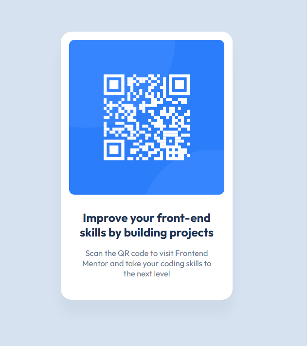

# Frontend Mentor - QR code component solution
This is a solution to the Frontend Mentor [QR code component challenge on Frontend Mentor](https://www.frontendmentor.io/challenges/qr-code-component-iux_sIO_H). Frontend Mentor challenges help to improve your coding skills by building realistic projects. 

## Table of contents

- [Overview](#overview)
  - [Screenshot](#screenshot)
  - [Links](#links)
- [My process](#my-process)
  - [Built with](#built-with)
  - [What I learned](#what-i-learned)
  - [Continued development](#continued-development)
  - [Useful resources](#useful-resources)
- [Author](#author)
- [Acknowledgments](#acknowledgments)

## Overview
The goal was to recreate a simple QR code card layout using semantic HTML and CSS. This project helped me practice flexbox centering, styling with border-radius and box-shadow, and reminding me how to publish my html on GitHub Pages. 

### Screenshot
Screenshot to the final project can be found here. 

### Links
- A link to the dev branch of the repo for this project on github can be found here: (https://github.com/ellamkoch/fem-qr-code-component/tree/dev)
- Live Site URL on git hub can be found here: (https://ellamkoch.github.io/fem-qr-code-component/)

## My process
-I started by setting up the project, but on Day 1 I had issues pushing my files from my PC up to the GitHub repo. I needed some help from Ulises in the breakout rooms to get that fixed so I could move forward that night.
-After that, I mostly followed along with the class recordings to build out the project.
-On Day 2, I was able to follow more in real time during class, which made it easier to catch mistakes and keep up with Ulises and update the CSS.
-Over the weekend, I went back and rewatched the first day and I built the HTML structure that had happened in day 1 (container, image, heading, paragraph), then styled it with CSS. 
-Then I rewatched Day 2, to ensure I had captured everything and that it was working correctly. 
-The main challenges were centering the card on the page and making the box shadow and border radius look right. I ended up using Flexbox to get the card centered vertically and horizontally. I had some of the class names wrong between the JS and the html, so this is why the image wasn't centering and going into its container like it should have, as well as a few spelling mistakes in the css. 
-I tested the site on Live Server as I was working on it. Thanks to the Live Server preview, I caught a couple of case sensitivity and pathing issues, and fixed those so the image would load correctly.

### Built with
- Semantic HTML5 markup
- CSS custom properties
- Flexbox
- Desktop first workflow
- GitHub for version control and GitHub pages for deployment
- VS Code for editing

### What I learned
-How to troubleshoot GitHub repo setup and pushing files — I struggled on Day 1 but got help in breakout rooms, which gave me a better understanding of version control.
-That following along live with class helps me catch mistakes faster, but rewatching recordings is just as valuable for reinforcing details I missed (like building the HTML structure from Day 1 while I had the repo issues).
-A reminder of how Flexbox works for centering.
-I was reminded of the value of using a CSS reset to keep layouts consistent across browsers:

`*,`
`*::before,`
`*::after { /* these reset styles to normal */`
    box-sizing: border-box;
    padding: 0;
    margin: 0;
`}`

-That typos and class mismatches between HTML and CSS silently break layouts — double-checking spelling is just as important as logic.
-How Live Server previewing helps catch issues early. 
-Small styling tweaks like box-shadow and border-radius really polish the look of the finished product.

### Continued development
-I want to get faster and more confident with GitHub workflows (pushing, pulling, and avoiding small setup mistakes).
-I still need more practice with Flexbox layouts so centering and alignment feel automatic instead of trial and error.
-Paying attention to class names and spelling is something I need to keep improving to avoid silent errors.
-I plan to keep working in CSS resets and best practices for JS and CSS so they become second nature when completing a project.
-As projects get more complex, I want to learn how to make my CSS and JS more organized and scalable (e.g., better naming conventions or using separate files for resets and main styles).
-As we’ll be doing more Frontend Mentor projects in class, I want to use each one as a chance to practice building cleaner layouts and improving my debugging process.

### Useful resources
-MDN Web Docs (Mozilla Developer Network) – Clear explanations for CSS properties the universal CSS reset.
-CSS Box-Shadow Generator (https://cssgenerator.org/box-shadow-css-generator.html ) – Super useful for experimenting with box-shadow values until I found the right look.
-Frontend Mentor Challenge Directions – The starter brief gave me a clear target for structure and styling.
-README Template from Frontend Mentor – Having a strong outline made it easier to write a polished README for my project.
-Figma Design File – Helped me read exact values for spacing, font sizes, and other required properties.

## Author
- GitHub - [@ellamkoch](https://github.com/ellamkoch)
- Frontend Mentor - [@ellamkoch](https://www.frontendmentor.io/profile/ellamkoch)

## Acknowledgments
Huge thanks to Ulises to helping me unravel my repo issues at the beginning. Little did I realize when I first started doing GitHub repos that I made the whole directory into a main accidentally when starting to learn about GitHub and pushing files to it via bash. I don't remember all I did, but I know I don't want to relive it! LOL. 

